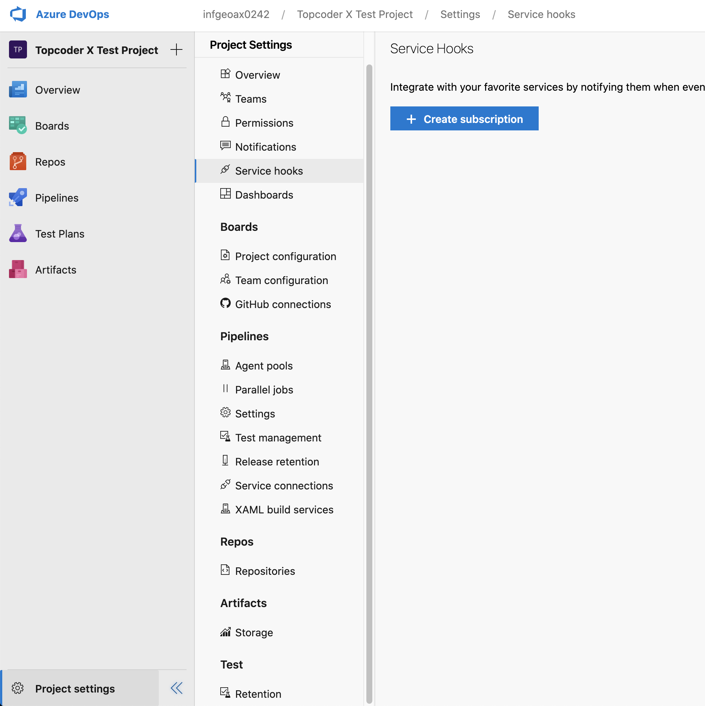
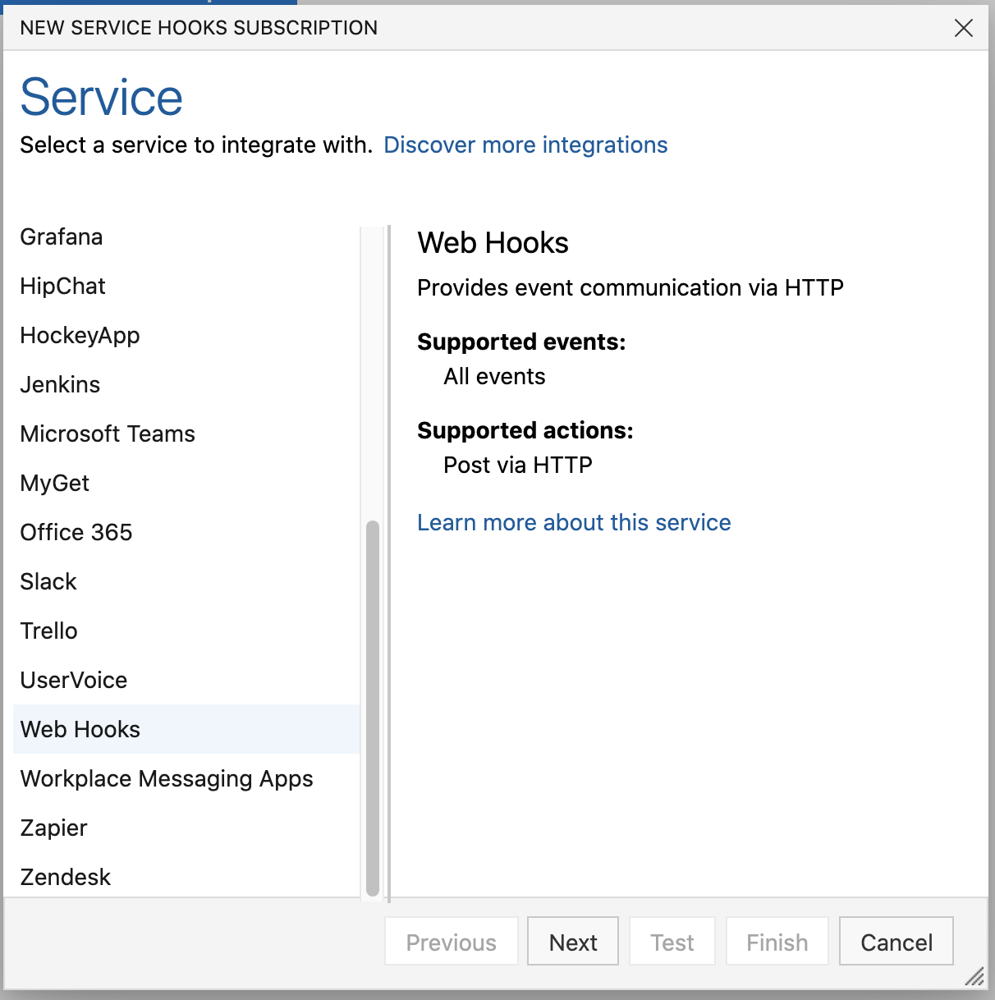
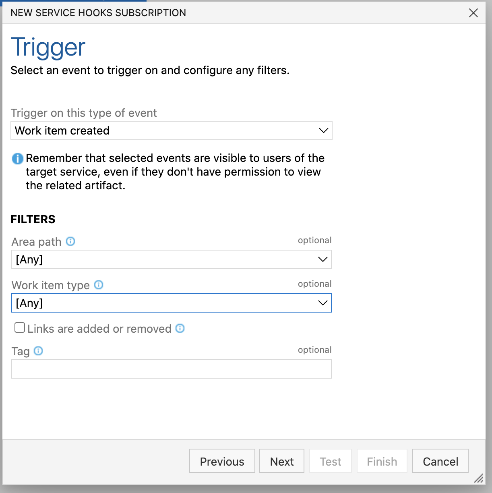
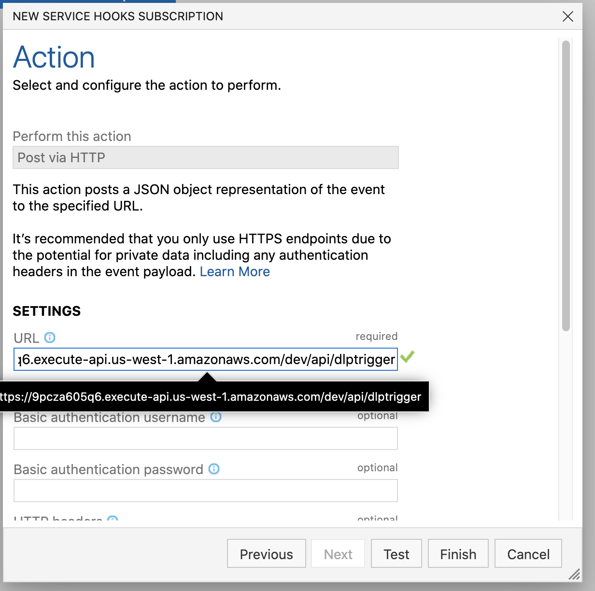
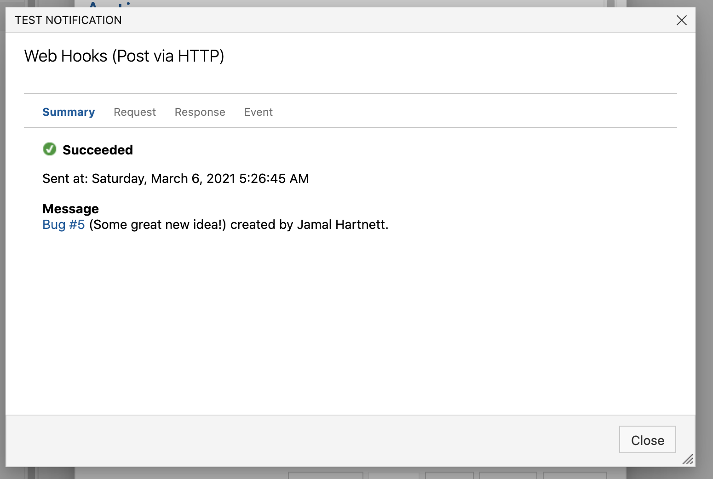
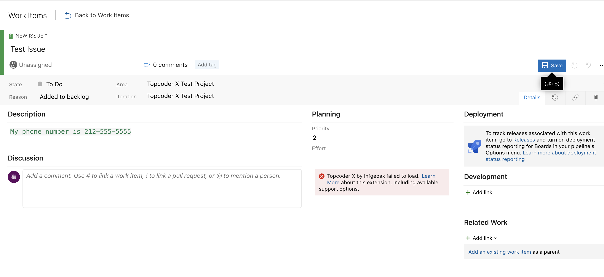

# Validation steps

1. Deploy everything to AWS

```
deploy/deploy-all.sh
```

2. The above command will print the AWS lambda endpoints for the dlp trigger (all with same url):

e.g.
```
  GET - https://9pcza605q6.execute-api.us-west-1.amazonaws.com/dev/api/dlptrigger
  POST - https://9pcza605q6.execute-api.us-west-1.amazonaws.com/dev/api/dlptrigger
  OPTIONS - https://9pcza605q6.execute-api.us-west-1.amazonaws.com/dev/api/dlptrigger
```

3. Add a webhook in Azure DevOps: Project Settings >> Service hooks >> Create subscription



4. Select "Webhooks"



5. Select "Work item created" for the trigger event



6. Copy and paste the AWS lambda endpoint



7. Click "Test" to test the webhook



8. Create a new work item with sensitive information in the description (My phone number is 212-555-5555)



9. Check the DynamoDB table `AdoWorkItemsDlpStatus` for the newly created item with dlpStatus='ISSUES_FOUND'

```
aws dynamodb --region us-west-1 scan --table-name AdoWorkItemsDlpStatus
```

Note: change the region argument if you deployed the webhook in a different region.

10. Check the GET endpoint, you can get project and resource id from the table scan:

```
curl '<endpoint_url>?project_id=<replace-with-project-id>&resource_id=<replace-with-resource-id>'
```
